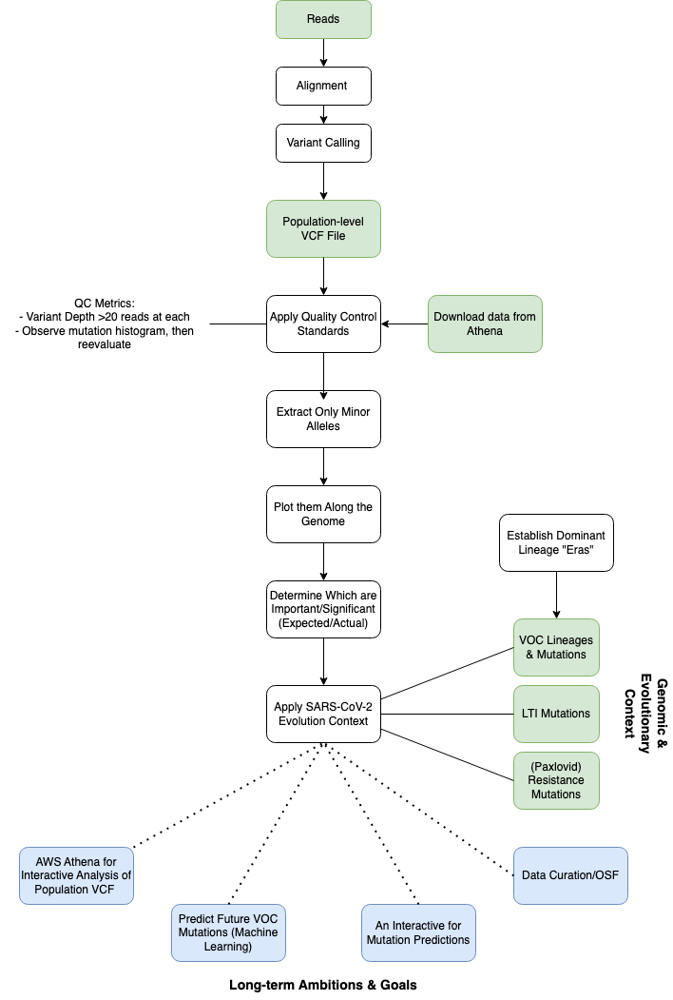

# Predicting SARS-CoV-2 Evolution Using Population-Scale Intra-Host Diversity Data Derived from Public SRA Data

List of participants and affiliations:
- Jesse Elder, California Department of Public Health (Team Leader)
- Indresh Singh, BV-BRC (Tech Lead)
- Rahil Ryder, California Department of Public Health (Writer)
- Xyanthine Parillon, University of Houston Downtown (Writer)
- Ruvarashe Madzime, Stellenbosch University

## Project Goals
The goal of this project is to compare SARS-CoV-2 Intra-host allele frequencies within a large dataset to analyze the minor allele frequencies not identified in the consensus fasta file. The VCF files will be plotted along the SARS-CoV-2 genome and variant time periods will be identified. Previously identified mutations from long-term SARS-CoV-2 infections, Paxlovid resistance mutations, and other Variant of Concern (VOC) mutations will be used as a guideline to identify mutation trends. This will give an underlying understanding of mutations developing during and before a major SARS-CoV-2 lineage takes over (i.e.. BA.5, XBB.1.5). Mutation patterns identified may enable machine learning to be applied to identify future VOCs. 

## Approach
  

File Descriptions:
CovidEras.xlsv: Time periods are selected from CoVariants.org where the dominant lineage is 46%-845 prevalent in the USA.

Minor_Allele_Query.sql: The SQL code queries the minor alleles in the SARS-CoV-2 VCF files. Using Amazon Athena, the data source used was AwsDataCatolog and the database was ncbi-vcf-codeathon-rc-db1. Metrics used is less than .5 frequency and greater than or equal to 20 reads.

BQ.1Wave_VCF.sql: This SQL code merges the complete VCF file with a subset of the metadata so that only the VCF data between Nov 21, 2022 - Jan 16, 2023 are included. Other queries will take subsets for the other eras of dominant lineages.

## Results
•     Started 194464510   QC, query, run   ended today 5006156 variants
•     Minor allele frequency rate of occurrence- maybe to predict the next occurrences
•     Minor allele reference code for read filtering, mapping and analysisgithub.com/neherlab/EV-D68_analysis_Dyrdak_2019github.com/neherlab/SVVC
•     Limitations-recurrent sequencing errors, independent mutations multiple times

## Future Work
