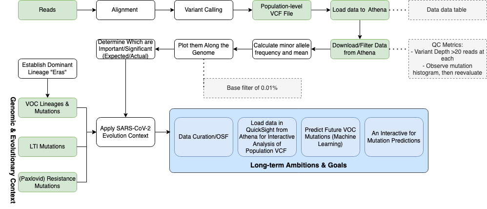
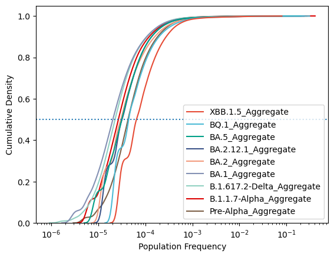
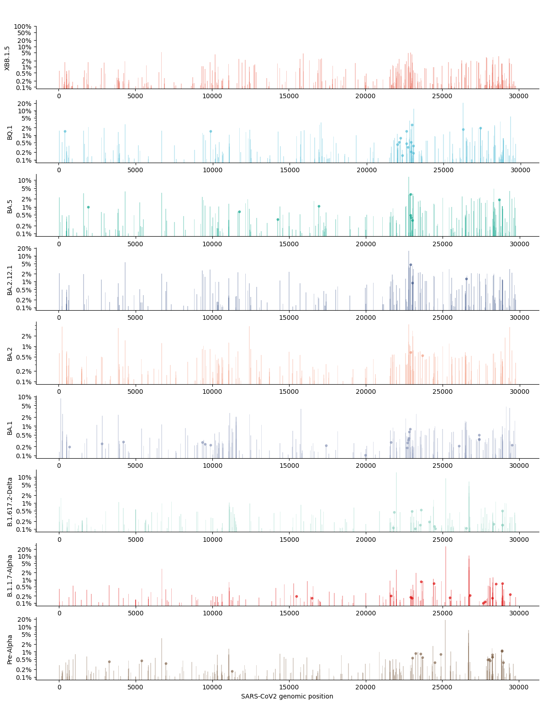

# Predicting SARS-CoV-2 Evolution Using Population-Scale Intra-Host Diversity Data Derived from Public SRA Data

List of participants and affiliations:
- Jesse Elder, California Department of Public Health (Team Leader)
- Indresh Singh, BV-BRC (Tech Lead)
- Rahil Ryder, California Department of Public Health (Writer)
- Xyanthine Parillon, University of Houston Downtown (Writer)
- Ruvarashe Madzime, Stellenbosch University
- Tamas Szabo, 
## Project Goals
The goal of this project is to analyze SARS-CoV-2 intra-host mutations in public SRA data to analyze minor alleles not identified in consensus fasta files. In addition to evaluating minor allele frequencies throughout the pandemic, we also aim to compare minor allele frequencies within specific waves of the pandemic. Previously identified mutations from Variant of Concern (VOC) as well long-term SARS-CoV-2 infections will be used as a guideline to identify mutation trends. This will give an underlying understanding of mutations developing during and before a major SARS-CoV-2 lineage takes over (i.e.. BA.5, XBB.1.5). Mutation patterns identified may enable machine learning to be applied to identify future VOCs. 

## Approach
  

## File Descriptions:
_Aggregate_Mean Directory:_
Input data for the histogram dipecting minor allele frequencies per genome positions

_Context_Data Directory:_
Files include lineage defining mutations, Covid-19 major lineage time periods, and gene positions.
- CovidEras.csv: A file providing date ranges during which certain lineages were dominant. Times periods are determined based on CoVariants website when each lineage accounts for >50% of all sequences.
- Gene_Positions.csv: A file providing nucleotide positions of genes in the SARS-CoV-2 genome.
- Lineage_Def_Mutations.csv: A file containting the mutations associated with each dominant lineage throughout the pandemic. Only includes mutations on top of previous dominant lineages (e.g. BA.1>B.1.617.2)

_Covid_Wave_Code Directory:_
- Code generating aggregated minor allele frequency data and mutation frequency data within the population. Each dominant lineage wave is given its own code directory.

_MAF_Predictors.pptx:_ Presentation Slides for the Codethon Final Presentations

_LineageTrends_withMinorAlleles.xlsx:_ Includes Population Frequency of Minor Alleles per SARS-CoV-2 Nucleotide Position for Variants of Concern (pink highlight is pop_freq>1%). Table annotates three or more SARS-CoV-2 VOC lineages with all greater than 1% population frequency  with relevant mutations at same position. 

## Results
Density Plot of Minor Alleles Presence in the Population
  
Histogram of Population Frequency of SARS-CoV-2 Minor Alleles of Dominant Lineage Eras over SARS-CoV-2 Genome Position
  
- Started 194464510   QC, query, run   ended today 5006156 variants
- Minor allele frequency rate of occurrence- potential to predict the next occurrences
- Minor allele reference code for read filtering, mapping and analysis github.com/neherlab/EV-D68_analysis_Dyrdak_2019github.com/neherlab/SVVC
- Limitations-recurrent sequencing errors, independent mutations multiple times

## Conclusions
- Covid pandemic characterized by waves of new lineages taking over
- Population-scale intra-host diversity data is under-studied
  - Rich data not captured by consensus genome analyses
- Spike and N gene mutations are common recurrent minor alleles
  - More diverse mutations after S gene post-BA.1 wave
  - Gives insight to gene regions outside of S-gene to look into for immune escape
- Lineage-defining mutations do recur in population prior to lineage dominance
  - Not clear if more frequent than other minor alleles
  - Statistical testing needed to know if population frequency elevated

## Future Work
- Machine Learning & Algorithms for predicting future mutations in dominant lineages
- Hotspots-Genes mutated more frequently than would be in the absence of selection
- Apply additional genomic context to evaluate evolutionary selection pressures
  - Known long-term infection mutations
  - Paxlovis-resistance mutations

